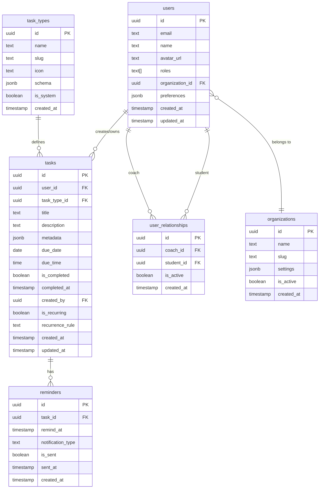

# Veritabanı Şeması - Kişisel Yaşam Planlayıcı

> [!IMPORTANT]
> Bu şema Supabase (PostgreSQL) için tasarlanmıştır ve Row Level Security (RLS) kullanacaktır.

## 📊 Veri Modeli Diyagramı



---

## 📋 Tablo Detayları

### 1. `users` - Kullanıcılar

Tüm kullanıcıları (öğrenci, koç, admin) tutar.

```sql
CREATE TABLE users (
  id UUID PRIMARY KEY DEFAULT uuid_generate_v4(),
  email TEXT UNIQUE NOT NULL,
  name TEXT NOT NULL,
  avatar_url TEXT,
  roles TEXT[] NOT NULL DEFAULT '{"student"}', -- ['student', 'coach', 'admin']
  organization_id UUID REFERENCES organizations(id),
  preferences JSONB DEFAULT '{}',
  created_at TIMESTAMP WITH TIME ZONE DEFAULT NOW(),
  updated_at TIMESTAMP WITH TIME ZONE DEFAULT NOW()
);

-- Indexes
CREATE INDEX idx_users_email ON users(email);
CREATE INDEX idx_users_organization ON users(organization_id);
CREATE INDEX idx_users_roles ON users USING GIN(roles);
```

**Alan Açıklamaları:**

| Alan | Tip | Açıklama |
|------|-----|----------|
| `id` | UUID | Primary key |
| `email` | TEXT | Email adresi (unique) |
| `name` | TEXT | Kullanıcı adı |
| `avatar_url` | TEXT | Profil fotoğrafı URL'si |
| `roles` | TEXT[] | Roller: `student`, `coach`, `admin` |
| `organization_id` | UUID | Bağlı olduğu organizasyon (multi-tenant için) |
| `preferences` | JSONB | Kullanıcı tercihleri (tema, bildirim ayarları vb.) |

**Örnek Preferences:**
```json
{
  "theme": "dark",
  "notifications_enabled": true,
  "language": "tr",
  "default_view": "today"
}
```

---

### 2. `organizations` - Organizasyonlar

Multi-tenant yapısı için organizasyonlar (sonraki fazda aktif olacak).

```sql
CREATE TABLE organizations (
  id UUID PRIMARY KEY DEFAULT uuid_generate_v4(),
  name TEXT NOT NULL,
  slug TEXT UNIQUE NOT NULL,
  settings JSONB DEFAULT '{}',
  is_active BOOLEAN DEFAULT true,
  created_at TIMESTAMP WITH TIME ZONE DEFAULT NOW(),
  updated_at TIMESTAMP WITH TIME ZONE DEFAULT NOW()
);

-- Indexes
CREATE INDEX idx_organizations_slug ON organizations(slug);
CREATE INDEX idx_organizations_active ON organizations(is_active);
```

**Alan Açıklamaları:**

| Alan | Tip | Açıklama |
|------|-----|----------|
| `slug` | TEXT | URL-friendly benzersiz tanımlayıcı |
| `settings` | JSONB | Organizasyona özel ayarlar |
| `is_active` | BOOLEAN | Organizasyon aktif mi? |

---

### 3. `user_relationships` - Koç-Öğrenci İlişkileri

Koçların öğrencileri ile ilişkilerini tutar.

```sql
CREATE TABLE user_relationships (
  id UUID PRIMARY KEY DEFAULT uuid_generate_v4(),
  coach_id UUID NOT NULL REFERENCES users(id) ON DELETE CASCADE,
  student_id UUID NOT NULL REFERENCES users(id) ON DELETE CASCADE,
  is_active BOOLEAN DEFAULT true,
  notes TEXT, -- Koçun öğrenci hakkında notları
  created_at TIMESTAMP WITH TIME ZONE DEFAULT NOW(),
  updated_at TIMESTAMP WITH TIME ZONE DEFAULT NOW(),
  
  -- Bir koç ile öğrenci arasında sadece bir aktif ilişki olabilir
  UNIQUE(coach_id, student_id)
);

-- Indexes
CREATE INDEX idx_relationships_coach ON user_relationships(coach_id);
CREATE INDEX idx_relationships_student ON user_relationships(student_id);
CREATE INDEX idx_relationships_active ON user_relationships(is_active);
```

**Kullanım Senaryoları:**
- Koç, atandığı öğrencilerin listesini çeker
- Öğrenci, kendisine atanmış koçu görür
- Koç, öğrencisine görev atayabilir

---

### 4. `task_types` - Görev Tipleri

Farklı görev tiplerini tanımlar (Video İzleme, To-Do vb.).

```sql
CREATE TABLE task_types (
  id UUID PRIMARY KEY DEFAULT uuid_generate_v4(),
  name TEXT NOT NULL,
  slug TEXT UNIQUE NOT NULL, -- 'video', 'todo', 'reading', vb.
  icon TEXT, -- Icon identifier (örn: 'play-circle', 'check-square')
  description TEXT,
  schema JSONB NOT NULL, -- Bu görev tipine özel alanların şeması
  is_system BOOLEAN DEFAULT false, -- Sistem varsayılan tipleri mi?
  is_active BOOLEAN DEFAULT true,
  created_at TIMESTAMP WITH TIME ZONE DEFAULT NOW(),
  updated_at TIMESTAMP WITH TIME ZONE DEFAULT NOW()
);

-- Indexes
CREATE INDEX idx_task_types_slug ON task_types(slug);
CREATE INDEX idx_task_types_active ON task_types(is_active);
```

**Örnek Task Types:**

#### Video İzleme
```json
{
  "id": "uuid-1",
  "name": "Video İzleme",
  "slug": "video",
  "icon": "play-circle",
  "schema": {
    "fields": [
      {
        "name": "video_url",
        "type": "url",
        "label": "Video Linki",
        "required": true,
        "placeholder": "https://youtube.com/watch?v=..."
      },
      {
        "name": "duration",
        "type": "number",
        "label": "Süre (dakika)",
        "required": false,
        "min": 1
      }
    ]
  },
  "is_system": true
}
```

#### Yapılacak (To-Do)
```json
{
  "id": "uuid-2",
  "name": "Yapılacak",
  "slug": "todo",
  "icon": "check-square",
  "schema": {
    "fields": [
      {
        "name": "notes",
        "type": "textarea",
        "label": "Notlar",
        "required": false
      }
    ]
  },
  "is_system": true
}
```

---

### 5. `tasks` - Görevler

Tüm görevleri tutar (kullanıcının kendi oluşturduğu veya koçun atadığı).

```sql
CREATE TABLE tasks (
  id UUID PRIMARY KEY DEFAULT uuid_generate_v4(),
  user_id UUID NOT NULL REFERENCES users(id) ON DELETE CASCADE, -- Görevi sahiplenen kullanıcı
  task_type_id UUID NOT NULL REFERENCES task_types(id),
  title TEXT NOT NULL,
  description TEXT,
  metadata JSONB DEFAULT '{}', -- Görev tipine özel veriler
  due_date DATE,
  due_time TIME,
  is_completed BOOLEAN DEFAULT false,
  completed_at TIMESTAMP WITH TIME ZONE,
  created_by UUID NOT NULL REFERENCES users(id), -- Kim oluşturdu (öğrenci veya koç)
  assigned_by UUID REFERENCES users(id), -- Eğer koç atadıysa
  is_private BOOLEAN DEFAULT false, -- YENİ: Öğrenciye özel, koçtan gizlenen görevler
  is_recurring BOOLEAN DEFAULT false,
  recurrence_rule TEXT, -- RRULE formatında (iCalendar standardı)
  tags TEXT[], -- Etiketler
  priority INTEGER DEFAULT 1, -- 1: düşük, 2: orta, 3: yüksek
  created_at TIMESTAMP WITH TIME ZONE DEFAULT NOW(),
  updated_at TIMESTAMP WITH TIME ZONE DEFAULT NOW()
);

-- Indexes
CREATE INDEX idx_tasks_user ON tasks(user_id);
CREATE INDEX idx_tasks_type ON tasks(task_type_id);
CREATE INDEX idx_tasks_due_date ON tasks(due_date);
CREATE INDEX idx_tasks_completed ON tasks(is_completed);
CREATE INDEX idx_tasks_created_by ON tasks(created_by);
CREATE INDEX idx_tasks_assigned_by ON tasks(assigned_by);
CREATE INDEX idx_tasks_tags ON tasks USING GIN(tags);
```

**Metadata Örnekleri:**

```json
// Video görevi
{
  "video_url": "https://youtube.com/watch?v=xxxxx",
  "duration": 15,
  "watched": false,
  "watch_progress": 0
}

// To-Do görevi
{
  "notes": "Online kurs sitelerini araştır"
}

// Egzersiz görevi (gelecekte)
{
  "exercise_type": "tai-chi",
  "duration": 30,
  "sets": 3,
  "reps": 8
}
```

**Recurrence Rule Örneği:**
```
FREQ=DAILY;INTERVAL=1  // Her gün
FREQ=WEEKLY;BYDAY=MO,WE,FR  // Pazartesi, Çarşamba, Cuma
FREQ=MONTHLY;BYMONTHDAY=1  // Her ayın 1'i
```

---

### 6. `reminders` - Hatırlatıcılar

Görevler için hatırlatıcı bildirimleri.

```sql
CREATE TABLE reminders (
  id UUID PRIMARY KEY DEFAULT uuid_generate_v4(),
  task_id UUID NOT NULL REFERENCES tasks(id) ON DELETE CASCADE,
  remind_at TIMESTAMP WITH TIME ZONE NOT NULL,
  notification_type TEXT DEFAULT 'push', -- 'push', 'email', 'sms'
  is_sent BOOLEAN DEFAULT false,
  sent_at TIMESTAMP WITH TIME ZONE,
  created_at TIMESTAMP WITH TIME ZONE DEFAULT NOW()
);

-- Indexes
CREATE INDEX idx_reminders_task ON reminders(task_id);
CREATE INDEX idx_reminders_remind_at ON reminders(remind_at);
CREATE INDEX idx_reminders_not_sent ON reminders(is_sent) WHERE is_sent = false;
```

**Kullanım:**
- Kullanıcı görev oluştururken hatırlatıcı saati seçer
- Sistem, `remind_at` zamanı geldiğinde bildirim gönderir
- `is_sent` = true olarak işaretlenir

---

## 🔒 Row Level Security (RLS) Politikaları

### Users Tablosu

```sql
-- Kullanıcılar sadece kendi profillerini görebilir
CREATE POLICY "Users can view own profile"
  ON users FOR SELECT
  USING (auth.uid() = id);

-- Kullanıcılar kendi profillerini güncelleyebilir
CREATE POLICY "Users can update own profile"
  ON users FOR UPDATE
  USING (auth.uid() = id);

-- Koçlar öğrencilerini görebilir
CREATE POLICY "Coaches can view their students"
  ON users FOR SELECT
  USING (
    id IN (
      SELECT student_id FROM user_relationships
      WHERE coach_id = auth.uid() AND is_active = true
    )
  );

-- Admin tüm kullanıcıları görebilir
CREATE POLICY "Admins can view all users"
  ON users FOR ALL
  USING ('admin' = ANY(
    SELECT roles FROM users WHERE id = auth.uid()
  ));
```

### Tasks Tablosu

```sql
-- Kullanıcılar kendi görevlerini görebilir
CREATE POLICY "Users can view own tasks"
  ON tasks FOR SELECT
  USING (user_id = auth.uid());

-- Kullanıcılar kendi görevlerini oluşturabilir
CREATE POLICY "Users can create own tasks"
  ON tasks FOR INSERT
  WITH CHECK (user_id = auth.uid() AND created_by = auth.uid());

-- Kullanıcılar kendi görevlerini güncelleyebilir + Koçlar öğrencilerinin görevlerini (gizli değilse)
CREATE POLICY "Users can update own tasks"
  ON tasks FOR UPDATE
  USING (
    user_id = auth.uid() 
    OR created_by = auth.uid() 
    OR assigned_by = auth.uid()
    OR (
        EXISTS (
            SELECT 1 FROM user_relationships ur
            WHERE ur.coach_id = auth.uid() AND ur.student_id = tasks.user_id AND ur.is_active = true
        )
        AND (is_private = false OR created_by = auth.uid())
    )
  );

-- Koçlar öğrencilerine görev atayabilir
CREATE POLICY "Coaches can create tasks for students"
  ON tasks FOR INSERT
  WITH CHECK (
    created_by = auth.uid() AND
    assigned_by = auth.uid() AND
    user_id IN (
      SELECT student_id FROM user_relationships
      WHERE coach_id = auth.uid() AND is_active = true
    )
  );

-- Koçlar öğrencilerinin görevlerini görebilir (Gizli olmayanlar)
CREATE POLICY "Coaches can view student tasks"
  ON tasks FOR SELECT
  USING (
    user_id IN (
      SELECT student_id FROM user_relationships
      WHERE coach_id = auth.uid() AND is_active = true
    )
    AND (is_private = false OR created_by = auth.uid())
  );
```

### User Relationships Tablosu

```sql
-- Koçlar kendi ilişkilerini görebilir
CREATE POLICY "Coaches can view their relationships"
  ON user_relationships FOR SELECT
  USING (coach_id = auth.uid());

-- Öğrenciler kendi koçlarını görebilir
CREATE POLICY "Students can view their coaches"
  ON user_relationships FOR SELECT
  USING (student_id = auth.uid());

### Subjects & Topics Tabloları

```sql
-- Subjects: Herkes sistem konularını görebilir + Kendi konularını
CREATE POLICY "Users can view own or system subjects"
  ON subjects FOR SELECT
  USING (created_by = auth.uid() OR is_system = true);

-- Topics: Görünür konuların alt başlıklarını görebilir
CREATE POLICY "Users can view own or system topics"
  ON topics FOR SELECT
  USING (
    EXISTS (
      SELECT 1 FROM subjects 
      WHERE subjects.id = topics.subject_id 
      AND (subjects.created_by = auth.uid() OR subjects.is_system = true)
    )
  );
```
```

---

## 🚀 Migration Script (İlk Kurulum)

```sql
-- Enable UUID extension
CREATE EXTENSION IF NOT EXISTS "uuid-ossp";

-- Create tables in order (dependencies first)

-- 1. Organizations
CREATE TABLE organizations (
  id UUID PRIMARY KEY DEFAULT uuid_generate_v4(),
  name TEXT NOT NULL,
  slug TEXT UNIQUE NOT NULL,
  settings JSONB DEFAULT '{}',
  is_active BOOLEAN DEFAULT true,
  created_at TIMESTAMP WITH TIME ZONE DEFAULT NOW(),
  updated_at TIMESTAMP WITH TIME ZONE DEFAULT NOW()
);

-- 2. Users
CREATE TABLE users (
  id UUID PRIMARY KEY DEFAULT uuid_generate_v4(),
  email TEXT UNIQUE NOT NULL,
  name TEXT NOT NULL,
  avatar_url TEXT,
  roles TEXT[] NOT NULL DEFAULT '{"student"}',
  organization_id UUID REFERENCES organizations(id),
  preferences JSONB DEFAULT '{}',
  created_at TIMESTAMP WITH TIME ZONE DEFAULT NOW(),
  updated_at TIMESTAMP WITH TIME ZONE DEFAULT NOW()
);

-- 3. User Relationships
CREATE TABLE user_relationships (
  id UUID PRIMARY KEY DEFAULT uuid_generate_v4(),
  coach_id UUID NOT NULL REFERENCES users(id) ON DELETE CASCADE,
  student_id UUID NOT NULL REFERENCES users(id) ON DELETE CASCADE,
  is_active BOOLEAN DEFAULT true,
  notes TEXT,
  created_at TIMESTAMP WITH TIME ZONE DEFAULT NOW(),
  updated_at TIMESTAMP WITH TIME ZONE DEFAULT NOW(),
  UNIQUE(coach_id, student_id)
);

-- 4. Task Types
CREATE TABLE task_types (
  id UUID PRIMARY KEY DEFAULT uuid_generate_v4(),
  name TEXT NOT NULL,
  slug TEXT UNIQUE NOT NULL,
  icon TEXT,
  description TEXT,
  schema JSONB NOT NULL,
  is_system BOOLEAN DEFAULT false,
  is_active BOOLEAN DEFAULT true,
  created_at TIMESTAMP WITH TIME ZONE DEFAULT NOW(),
  updated_at TIMESTAMP WITH TIME ZONE DEFAULT NOW()
);

-- 5. Tasks
CREATE TABLE tasks (
  id UUID PRIMARY KEY DEFAULT uuid_generate_v4(),
  user_id UUID NOT NULL REFERENCES users(id) ON DELETE CASCADE,
  task_type_id UUID NOT NULL REFERENCES task_types(id),
  title TEXT NOT NULL,
  description TEXT,
  metadata JSONB DEFAULT '{}',
  due_date DATE,
  due_time TIME,
  is_completed BOOLEAN DEFAULT false,
  completed_at TIMESTAMP WITH TIME ZONE,
  created_by UUID NOT NULL REFERENCES users(id),
  assigned_by UUID REFERENCES users(id),
  is_recurring BOOLEAN DEFAULT false,
  recurrence_rule TEXT,
  tags TEXT[],
  priority INTEGER DEFAULT 1,
  created_at TIMESTAMP WITH TIME ZONE DEFAULT NOW(),
  updated_at TIMESTAMP WITH TIME ZONE DEFAULT NOW()
);

-- 6. Reminders
CREATE TABLE reminders (
  id UUID PRIMARY KEY DEFAULT uuid_generate_v4(),
  task_id UUID NOT NULL REFERENCES tasks(id) ON DELETE CASCADE,
  remind_at TIMESTAMP WITH TIME ZONE NOT NULL,
  notification_type TEXT DEFAULT 'push',
  is_sent BOOLEAN DEFAULT false,
  sent_at TIMESTAMP WITH TIME ZONE,
  created_at TIMESTAMP WITH TIME ZONE DEFAULT NOW()
);

-- 7. Subjects
CREATE TABLE subjects (
  id UUID PRIMARY KEY DEFAULT uuid_generate_v4(),
  organization_id UUID,
  name TEXT NOT NULL,
  description TEXT,
  icon TEXT,
  color TEXT DEFAULT '#4F46E5',
  is_active BOOLEAN DEFAULT true,
  is_system BOOLEAN DEFAULT false, -- YENİ: Sistem genel konuları
  created_by UUID NOT NULL REFERENCES users(id),
  created_at TIMESTAMP WITH TIME ZONE DEFAULT NOW(),
  updated_at TIMESTAMP WITH TIME ZONE DEFAULT NOW()
);

-- 8. Topics
CREATE TABLE topics (
  id UUID PRIMARY KEY DEFAULT uuid_generate_v4(),
  subject_id UUID NOT NULL REFERENCES subjects(id) ON DELETE CASCADE,
  name TEXT NOT NULL,
  description TEXT,
  order_index INTEGER DEFAULT 0,
  is_active BOOLEAN DEFAULT true,
  is_system BOOLEAN DEFAULT false, -- YENİ
  created_by UUID NOT NULL REFERENCES users(id),
  created_at TIMESTAMP WITH TIME ZONE DEFAULT NOW(),
  updated_at TIMESTAMP WITH TIME ZONE DEFAULT NOW()
);

-- 9. Resources
CREATE TABLE resources (
  id UUID PRIMARY KEY DEFAULT uuid_generate_v4(),
  subject_id UUID NOT NULL REFERENCES subjects(id) ON DELETE CASCADE,
  topic_id UUID REFERENCES topics(id) ON DELETE SET NULL,
  name TEXT NOT NULL,
  type TEXT CHECK (type IN ('video', 'document', 'link', 'book')),
  url TEXT,
  description TEXT,
  metadata JSONB DEFAULT '{}',
  is_active BOOLEAN DEFAULT true,
  created_by UUID NOT NULL REFERENCES users(id),
  created_at TIMESTAMP WITH TIME ZONE DEFAULT NOW(),
  updated_at TIMESTAMP WITH TIME ZONE DEFAULT NOW()
);

-- 10. Habits
CREATE TABLE habits (
  id UUID PRIMARY KEY DEFAULT uuid_generate_v4(),
  user_id UUID NOT NULL REFERENCES users(id) ON DELETE CASCADE,
  subject_id UUID REFERENCES subjects(id) ON DELETE SET NULL,
  topic_id UUID REFERENCES topics(id) ON DELETE SET NULL,
  name TEXT NOT NULL,
  description TEXT,
  frequency TEXT NOT NULL CHECK (frequency IN ('daily', 'weekly', 'monthly', 'custom')),
  frequency_days INTEGER[],
  target_type TEXT CHECK (target_type IN ('count', 'duration', 'boolean')),
  target_count INTEGER,
  target_duration INTEGER,
  color TEXT DEFAULT '#10B981',
  icon TEXT DEFAULT '⭐',
  current_streak INTEGER DEFAULT 0,
  longest_streak INTEGER DEFAULT 0,
  total_completions INTEGER DEFAULT 0,
  start_date DATE NOT NULL DEFAULT CURRENT_DATE,
  end_date DATE,
  is_active BOOLEAN DEFAULT true,
  created_at TIMESTAMP WITH TIME ZONE DEFAULT NOW(),
  updated_at TIMESTAMP WITH TIME ZONE DEFAULT NOW()
);

-- 11. Habit Completions
CREATE TABLE habit_completions (
  id UUID PRIMARY KEY DEFAULT uuid_generate_v4(),
  habit_id UUID NOT NULL REFERENCES habits(id) ON DELETE CASCADE,
  user_id UUID NOT NULL REFERENCES users(id) ON DELETE CASCADE,
  completed_at TIMESTAMP WITH TIME ZONE DEFAULT NOW(),
  completed_date DATE NOT NULL,
  count INTEGER DEFAULT 1,
  duration INTEGER,
  notes TEXT,
  created_at TIMESTAMP WITH TIME ZONE DEFAULT NOW()
);

-- Create indexes (omitted for brevity, see individual table sections above)

-- Insert default task types
INSERT INTO task_types (name, slug, icon, schema, is_system) VALUES
('Video İzleme', 'video', 'play-circle', '{
  "fields": [
    {"name": "video_url", "type": "url", "label": "Video Linki", "required": true},
    {"name": "duration", "type": "number", "label": "Süre (dk)", "required": false}
  ]
}', true),
('Yapılacak', 'todo', 'check-square', '{
  "fields": [
    {"name": "notes", "type": "textarea", "label": "Notlar", "required": false}
  ]
}', true);

-- Enable RLS on all tables
ALTER TABLE users ENABLE ROW LEVEL SECURITY;
ALTER TABLE organizations ENABLE ROW LEVEL SECURITY;
ALTER TABLE user_relationships ENABLE ROW LEVEL SECURITY;
ALTER TABLE task_types ENABLE ROW LEVEL SECURITY;
ALTER TABLE tasks ENABLE ROW LEVEL SECURITY;
ALTER TABLE reminders ENABLE ROW LEVEL SECURITY;

-- Create RLS policies (see RLS section above for details)
```

---

## 📈 Gelecek Genişletmeler

### Eklenecek Tablolar (Sonraki Fazlarda)

#### `progress_logs` - İlerleme Kayıtları
```sql
CREATE TABLE progress_logs (
  id UUID PRIMARY KEY DEFAULT uuid_generate_v4(),
  user_id UUID NOT NULL REFERENCES users(id),
  task_id UUID REFERENCES tasks(id),
  log_type TEXT NOT NULL, -- 'task_completed', 'goal_achieved', 'milestone', vb.
  data JSONB,
  created_at TIMESTAMP WITH TIME ZONE DEFAULT NOW()
);
```

#### `goals` - Hedefler
```sql
CREATE TABLE goals (
  id UUID PRIMARY KEY DEFAULT uuid_generate_v4(),
  user_id UUID NOT NULL REFERENCES users(id),
  title TEXT NOT NULL,
  description TEXT,
  target_date DATE,
  is_achieved BOOLEAN DEFAULT false,
  created_at TIMESTAMP WITH TIME ZONE DEFAULT NOW()
);
```

#### `messages` - Koç-Öğrenci Mesajlaşma
```sql
CREATE TABLE messages (
  id UUID PRIMARY KEY DEFAULT uuid_generate_v4(),
  from_user_id UUID NOT NULL REFERENCES users(id),
  to_user_id UUID NOT NULL REFERENCES users(id),
  message TEXT NOT NULL,
  is_read BOOLEAN DEFAULT false,
  created_at TIMESTAMP WITH TIME ZONE DEFAULT NOW()
);
```

---

## 🔧 Utility Functions

### Update timestamp trigger
```sql
CREATE OR REPLACE FUNCTION update_updated_at_column()
RETURNS TRIGGER AS $$
BEGIN
  NEW.updated_at = NOW();
  RETURN NEW;
END;
$$ LANGUAGE plpgsql;

-- Apply to all tables
CREATE TRIGGER update_users_updated_at BEFORE UPDATE ON users
  FOR EACH ROW EXECUTE FUNCTION update_updated_at_column();

CREATE TRIGGER update_organizations_updated_at BEFORE UPDATE ON organizations
  FOR EACH ROW EXECUTE FUNCTION update_updated_at_column();

CREATE TRIGGER update_user_relationships_updated_at BEFORE UPDATE ON user_relationships
  FOR EACH ROW EXECUTE FUNCTION update_updated_at_column();

CREATE TRIGGER update_task_types_updated_at BEFORE UPDATE ON task_types
  FOR EACH ROW EXECUTE FUNCTION update_updated_at_column();

CREATE TRIGGER update_tasks_updated_at BEFORE UPDATE ON tasks
  FOR EACH ROW EXECUTE FUNCTION update_updated_at_column();
```

---

## ✅ Doğrulama Sorguları

### En basit kullanım senaryosu örneği

```sql
-- 1. Öğrenci kaydı oluştur
INSERT INTO users (email, name, roles) VALUES
  ('student@example.com', 'Ahmet Yılmaz', '{"student"}');

-- 2. Video izleme görevi oluştur
INSERT INTO tasks (user_id, task_type_id, title, description, metadata, due_date, created_by)
VALUES (
  (SELECT id FROM users WHERE email = 'student@example.com'),
  (SELECT id FROM task_types WHERE slug = 'video'),
  'Sabah Rutini',
  'Temel 8 hareket',
  '{"video_url": "https://youtube.com/watch?v=xxxxx", "duration": 15}',
  CURRENT_DATE,
  (SELECT id FROM users WHERE email = 'student@example.com')
);

-- 3. Hatırlatıcı ekle
INSERT INTO reminders (task_id, remind_at)
VALUES (
  (SELECT id FROM tasks WHERE title = 'Sabah Rutini'),
  CURRENT_DATE + INTERVAL '7 hours' -- Sabah 7'de hatırlat
);

-- 4. Görevleri listele (bugünkü)
SELECT 
  t.title,
  t.description,
  tt.name AS task_type,
  t.metadata,
  t.due_time,
  t.is_completed
FROM tasks t
JOIN task_types tt ON t.task_type_id = tt.id
WHERE t.user_id = (SELECT id FROM users WHERE email = 'student@example.com')
  AND t.due_date = CURRENT_DATE
ORDER BY t.due_time NULLS LAST;
```

---

  url TEXT,
  description TEXT,
  metadata JSONB DEFAULT '{}',
  is_active BOOLEAN DEFAULT true,
  created_by UUID NOT NULL REFERENCES users(id),
  created_at TIMESTAMP WITH TIME ZONE DEFAULT NOW(),
  updated_at TIMESTAMP WITH TIME ZONE DEFAULT NOW()
);

-- 10. Habits
CREATE TABLE habits (
  id UUID PRIMARY KEY DEFAULT uuid_generate_v4(),
  user_id UUID NOT NULL REFERENCES users(id) ON DELETE CASCADE,
  subject_id UUID REFERENCES subjects(id) ON DELETE SET NULL,
  topic_id UUID REFERENCES topics(id) ON DELETE SET NULL,
  name TEXT NOT NULL,
  description TEXT,
  frequency TEXT NOT NULL CHECK (frequency IN ('daily', 'weekly', 'monthly', 'custom')),
  frequency_days INTEGER[],
  target_type TEXT CHECK (target_type IN ('count', 'duration', 'boolean')),
  target_count INTEGER,
  target_duration INTEGER,
  color TEXT DEFAULT '#10B981',
  icon TEXT DEFAULT '⭐',
  current_streak INTEGER DEFAULT 0,
  longest_streak INTEGER DEFAULT 0,
  total_completions INTEGER DEFAULT 0,
  start_date DATE NOT NULL DEFAULT CURRENT_DATE,
  end_date DATE,
  is_active BOOLEAN DEFAULT true,
  created_at TIMESTAMP WITH TIME ZONE DEFAULT NOW(),
  updated_at TIMESTAMP WITH TIME ZONE DEFAULT NOW()
);

-- 11. Habit Completions
CREATE TABLE habit_completions (
  id UUID PRIMARY KEY DEFAULT uuid_generate_v4(),
  habit_id UUID NOT NULL REFERENCES habits(id) ON DELETE CASCADE,
  user_id UUID NOT NULL REFERENCES users(id) ON DELETE CASCADE,
  completed_at TIMESTAMP WITH TIME ZONE DEFAULT NOW(),
  completed_date DATE NOT NULL,
  count INTEGER DEFAULT 1,
  duration INTEGER,
  notes TEXT,
  created_at TIMESTAMP WITH TIME ZONE DEFAULT NOW()
);

-- Create indexes (omitted for brevity, see individual table sections above)

-- Insert default task types
INSERT INTO task_types (name, slug, icon, schema, is_system) VALUES
('Video İzleme', 'video', 'play-circle', '{
  "fields": [
    {"name": "video_url", "type": "url", "label": "Video Linki", "required": true},
    {"name": "duration", "type": "number", "label": "Süre (dk)", "required": false}
  ]
}', true),
('Yapılacak', 'todo', 'check-square', '{
  "fields": [
    {"name": "notes", "type": "textarea", "label": "Notlar", "required": false}
  ]
}', true);

-- Enable RLS on all tables
ALTER TABLE users ENABLE ROW LEVEL SECURITY;
ALTER TABLE organizations ENABLE ROW LEVEL SECURITY;
ALTER TABLE user_relationships ENABLE ROW LEVEL SECURITY;
ALTER TABLE task_types ENABLE ROW LEVEL SECURITY;
ALTER TABLE tasks ENABLE ROW LEVEL SECURITY;
ALTER TABLE reminders ENABLE ROW LEVEL SECURITY;

-- Create RLS policies (see RLS section above for details)
```

---

## 📈 Gelecek Genişletmeler

### Eklenecek Tablolar (Sonraki Fazlarda)

#### `progress_logs` - İlerleme Kayıtları
```sql
CREATE TABLE progress_logs (
  id UUID PRIMARY KEY DEFAULT uuid_generate_v4(),
  user_id UUID NOT NULL REFERENCES users(id),
  task_id UUID REFERENCES tasks(id),
  log_type TEXT NOT NULL, -- 'task_completed', 'goal_achieved', 'milestone', vb.
  data JSONB,
  created_at TIMESTAMP WITH TIME ZONE DEFAULT NOW()
);
```

#### `goals` - Hedefler
```sql
CREATE TABLE goals (
  id UUID PRIMARY KEY DEFAULT uuid_generate_v4(),
  user_id UUID NOT NULL REFERENCES users(id),
  title TEXT NOT NULL,
  description TEXT,
  target_date DATE,
  is_achieved BOOLEAN DEFAULT false,
  created_at TIMESTAMP WITH TIME ZONE DEFAULT NOW()
);
```

#### `messages` - Koç-Öğrenci Mesajlaşma
```sql
CREATE TABLE messages (
  id UUID PRIMARY KEY DEFAULT uuid_generate_v4(),
  from_user_id UUID NOT NULL REFERENCES users(id),
  to_user_id UUID NOT NULL REFERENCES users(id),
  message TEXT NOT NULL,
  is_read BOOLEAN DEFAULT false,
  created_at TIMESTAMP WITH TIME ZONE DEFAULT NOW()
);
```

---

## 🔧 Utility Functions

### Update timestamp trigger
```sql
CREATE OR REPLACE FUNCTION update_updated_at_column()
RETURNS TRIGGER AS $$
BEGIN
  NEW.updated_at = NOW();
  RETURN NEW;
END;
$$ LANGUAGE plpgsql;

-- Apply to all tables
CREATE TRIGGER update_users_updated_at BEFORE UPDATE ON users
  FOR EACH ROW EXECUTE FUNCTION update_updated_at_column();

CREATE TRIGGER update_organizations_updated_at BEFORE UPDATE ON organizations
  FOR EACH ROW EXECUTE FUNCTION update_updated_at_column();

CREATE TRIGGER update_user_relationships_updated_at BEFORE UPDATE ON user_relationships
  FOR EACH ROW EXECUTE FUNCTION update_updated_at_column();

CREATE TRIGGER update_task_types_updated_at BEFORE UPDATE ON task_types
  FOR EACH ROW EXECUTE FUNCTION update_updated_at_column();

CREATE TRIGGER update_tasks_updated_at BEFORE UPDATE ON tasks
  FOR EACH ROW EXECUTE FUNCTION update_updated_at_column();
```

---

## ✅ Doğrulama Sorguları

### En basit kullanım senaryosu örneği

```sql
-- 1. Öğrenci kaydı oluştur
INSERT INTO users (email, name, roles) VALUES
  ('student@example.com', 'Ahmet Yılmaz', '{"student"}');

-- 2. Video izleme görevi oluştur
INSERT INTO tasks (user_id, task_type_id, title, description, metadata, due_date, created_by)
VALUES (
  (SELECT id FROM users WHERE email = 'student@example.com'),
  (SELECT id FROM task_types WHERE slug = 'video'),
  'Sabah Rutini',
  'Temel 8 hareket',
  '{"video_url": "https://youtube.com/watch?v=xxxxx", "duration": 15}',
  CURRENT_DATE,
  (SELECT id FROM users WHERE email = 'student@example.com')
);

-- 3. Hatırlatıcı ekle
INSERT INTO reminders (task_id, remind_at)
VALUES (
  (SELECT id FROM tasks WHERE title = 'Sabah Rutini'),
  CURRENT_DATE + INTERVAL '7 hours' -- Sabah 7'de hatırlat
);

-- 4. Görevleri listele (bugünkü)
SELECT 
  t.title,
  t.description,
  tt.name AS task_type,
  t.metadata,
  t.due_time,
  t.is_completed
FROM tasks t
JOIN task_types tt ON t.task_type_id = tt.id
WHERE t.user_id = (SELECT id FROM users WHERE email = 'student@example.com')
  AND t.due_date = CURRENT_DATE
ORDER BY t.due_time NULLS LAST;
```

---

> [!NOTE]
> **Sonraki Adımlar**
> 1. Supabase projesinde bu migration'ı çalıştır
> 2. Auth konfigürasyonunu yap
> 3. RLS politikalarını test et
> 4. Next.js'ten Supabase client ile bağlan

---

### 7. `exam_templates` - Sınav Şablonları

Kurumsal deneme sınavlarının yapısını tanımlar (TYT, AYT, LGS vb.).

```sql
CREATE TABLE exam_templates (
    id UUID DEFAULT gen_random_uuid() PRIMARY KEY,
    name TEXT NOT NULL,
    sections JSONB NOT NULL DEFAULT '[]', -- e.g., [{"key": "math", "name": "Matematik", "question_count": 40}]
    created_at TIMESTAMP WITH TIME ZONE DEFAULT timezone('utc'::text, now()) NOT NULL
);
```

**JSONB Yapısı (sections):**
```json
[
  {
    "key": "turkish",
    "name": "Türkçe",
    "question_count": 40
  },
  {
    "key": "math",
    "name": "Matematik",
    "question_count": 40
  }
]
```

---

### 8. `exams` - Sınavlar

Belirli bir tarihte yapılacak olan spesifik sınavlar.

```sql
CREATE TABLE exams (
    id UUID DEFAULT gen_random_uuid() PRIMARY KEY,
    template_id UUID REFERENCES exam_templates(id),
    name TEXT NOT NULL, -- Örn: "TYT Deneme-1"
    date DATE NOT NULL,
    created_at TIMESTAMP WITH TIME ZONE DEFAULT timezone('utc'::text, now()) NOT NULL
);
```

---

### 9. `exam_results` - Sınav Sonuçları

Öğrenci bazlı sınav sonuçları ve analiz verileri.

```sql
CREATE TABLE exam_results (
    id UUID DEFAULT gen_random_uuid() PRIMARY KEY,
    user_id UUID REFERENCES users(id) NOT NULL,
    exam_id UUID REFERENCES exams(id) NOT NULL,
    details JSONB NOT NULL DEFAULT '{}',
    total_net NUMERIC(5, 2) DEFAULT 0,
    created_at TIMESTAMP WITH TIME ZONE DEFAULT timezone('utc'::text, now()) NOT NULL,
    UNIQUE(user_id, exam_id)
);
```

**JSONB Yapısı (details):**
```json
{
  "math": {
    "correct": 35,
    "incorrect": 2,
    "empty": 3,
    "net": 34.5
  },
  "turkish": {
    "correct": 38,
    "incorrect": 2,
    "empty": 0,
    "net": 37.5
  }
}
```

---

## 🔒 Row Level Security (RLS) - Exam Module

### Exam Templates & Exams
- **Görüntüleme:** Herkes görebilir.
- **Yönetim (Admin):** Sadece `admin` rolüne sahip kullanıcılar ekleyebilir/düzenleyebilir.

### Exam Results
- **Öğrenci:** Kendi sonuçlarını yönetebilir (görebilir ve ekleyebilir).
- **Koç:** Atanmış (aktif ilişkisi olan) öğrencilerinin sonuçlarını yönetebilir.

---
